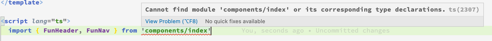
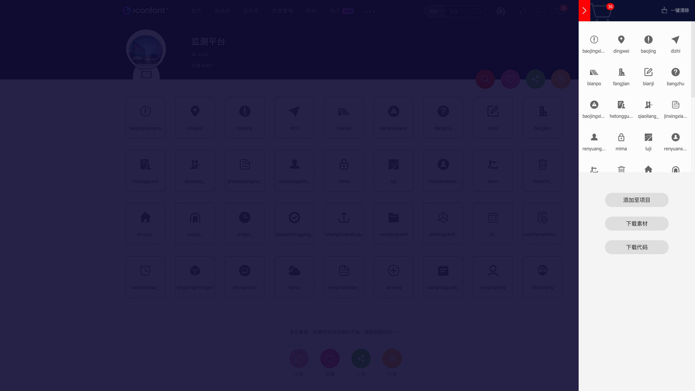

# Frontend Template

[](http://commitizen.github.io/cz-cli/)  

该项目主要使用 Vue3 生态内的技术搭建而成，包括前端框架 Vue3、构建工具 Vite、Css 框架 TailwindCss 等等，Fork 该项目，快速开始前端开发。

## IDE 设置

[VSCode](https://code.visualstudio.com/) + [VS Code for Vite](https://marketplace.visualstudio.com/items?itemName=antfu.vite)

## 目录介绍

```
.
├── README.md
├── changelog.config.js
├── commitlint.config.js
├── index.html
├── package.json  // Node.js 项目依赖描述文件
├── postcss.config.js
├── public // 公共资源目录，存放一些不会在代码中使用的资源
├── scripts // 存放一些脚本
├── src
│   ├── App.vue // Vue 的根组件
│   ├── apis // 封装 API 请求
│   ├── assets // 静态资源目录
│   ├── components // 公共组件
│   ├── main.ts // Vite 构建的入口文件
│   ├── nav.config.json
│   ├── routers // 前端路由，参见 Vue Router
│   ├── shims-vue.d.ts
│   ├── styles // 全局样式
│   ├── utils // 公共工具
│   ├── views // 视图组件
│   └── vite-env.d.ts
├── tailwind.config.js
├── tsconfig.json
├── vite.config.ts // Vite 的配置文件
└── yarn.lock
```

## 环境准备

### 安装 Node.js

进入 [Node.js](https://nodejs.org/en/) 的官方网站，下载一个 Node.js 的安装包直接安装即可。因为 Node.js 版本不一致可能会导致一些问题，所以通常可以借助 [nvm](https://github.com/nvm-sh/nvm) 来下载 Node.js，它可以很方便地切换 Node.js 版本，使用成本较低，推荐使用 nvm 而不是直接下载 Node.js 的安装包。

安装完毕后可以在终端中输入命令 `node -v` 来检查 Node.js 是否安装成功。

### 安装 Yarn

项目使用 [Yarn](https://yarnpkg.com/) 来管理依赖包，而是不是 Node.js 自带的 Npm，因为 Yarn 下载依赖包的速度更快。

```shell
npm install -g yarn
```

安装完成后，打开终端切换到项目的根目录下，执行命令 `yarn install` 安装依赖，所有依赖项的信息记录在 package.json 与 yarn.lock 中。

package.json 与 yarn.lock 文件具有重要意义，如若想进一步了解它们可以访问 [package.json](https://docs.npmjs.com/cli/v7/configuring-npm/package-json/)、[yarn.lock](https://classic.yarnpkg.com/en/docs/yarn-lock/)。

### 安装依赖

```shell
yarn install
```

### 开发

```shell
yarn dev
```

### 构建

```shell
yarn build
```

### 生成新的组件

```shell
yarn gen [-n name] [-d dir]
```

| 名称 | require | 含义                                    |
| ---- | ------- | --------------------------------------- |
| n    | true    | 组件名称                                |
| d    | false   | 组件所在的目录，默认“./src/components/” |

具体内容见 /scripts/gen.sh 。

## 运行 Docker 镜像

// TODO: 补充 Docker 方式说明

## 配置环境变量

TODO: 部署环境变量说明

## Mock

// TODO: add something

## 配置主题

在 [在线生成主题](https://element-plus.github.io/theme-chalk-preview/#/zh-CN) 页面下载主题，然后放到项目下的 /src/styles/element-plus 目录中，并将样式导入到 /src/main.ts 中，

main.ts

```typescript
import './styles/element-plus/index.css'
```

最后修改一下 vite.config.ts 中的配置：

vite.config.ts

```typescript
styleImport({
  libs: [
    {
      libraryName: 'element-plus',
      esModule: true,
      ensureStyleFile: true,
      resolveStyle: name => {
        name = name.slice(3)
        // 修改这一行的地址，将它指到主题文件所在的目录
        return `./src/styles/element-plus/${name}.css`
      },
      resolveComponent: name => {
        return `element-plus/lib/${name}`
      },
    },
  ],
})
```

## 配置导航栏

本项目根据前端路由自动生产导航栏，前端路由配置文件保存在 /src/routers 目录中，只需要在路由的 meta 元信息中加入特定的字段。

比如：

```typescript
{
  path: '/dashboard',
  component: () => import('/views/Dashboard/index.vue'),
  meta: {
    name: 'dashboard',
    icon: 'grape',
    order: 1
  },
}
```

meta 元信息解释

| 字段           | 类型    | 默认值 | 必填 | 含义                                                                       |
| -------------- | ------- | ------ | ---- | -------------------------------------------------------------------------- |
| name           | string  | -      | 是   | 导航名称，供 i18n 翻译的 key                                               |
| icon           | string  | -      | 否   | ElIcon 图标名称，参照[图标使用方式](#图标使用方式)，注意省略“el-icon-”前缀 |
| showPageHeader | boolean | false  | 否   | 是否在页面的头部显示“el-page-header” 组件                                  |

## 图标使用方式

组件库默认图标参考 [Icon](https://element-plus.org/#/zh-CN/component/icon)，自定义的图标参考 [Q&A](#qa)。

## 引入新的 ElementPlus 组件

在 /src/main.ts 下参照如下的方式引入 ElementPlus 的组件

```typescript
// 按需引入 ElementPlus 组件或指令
app.use(ElButton)
app.use(ElSelect)
app.use(ElMenu)
...
```

完整的组件列表参考 [引入 Element Plus](https://element-plus.org/#/zh-CN/component/quickstart)，没有使用的组件不要引入，否则会导致最后打包出来的制品体积更大。

## 国际化

本项目已经支持国际化，根据需要在 /src/locales 目录添加翻译文件即可。

建议文件名称格式为 “[语言代码].yaml”，比如简体中文的语言代码为“zh-cn”(参考 [语言列表](https://github.com/element-plus/element-plus/tree/dev/packages/locale/lang))，文件名为“zh-cn.yaml”。

项目默认的语言为“zh-CN”，可以根据需要在 /src/main.ts 中配置默认语言。

```typescript
const i18n = createI18n({
  locale: /* 默认语言 */ 'zh-cn',
  messages,
})
```

创建翻译文件并定义了 key 之后，可以按照下面的方式使用:

zh-cn.yaml

```yaml
languages: 多语种
```

xxx.vue

```html
<template>
  <div>{{t('languages') }}</div>
</template>

<script lang="ts">
  import { defineComponent } from 'vue'
  import { useI18n } from 'vue-i18n'

  export default defineComponent({
    name: 'KgTable',
    setup() {
      const { t } = useI18n()
      return { t }
    },
  })
</script>
```

更多高级用法见 [Vue I18n](https://kazupon.github.io/vue-i18n/) 。

## 构建工具

项目使用 [vite](https://vitejs.dev/) 作为构建工具，配置文件 vite.config.ts。

## HTTP 请求

本项目中统一使用 [Axios](https://axios-http.com/zh/) 来发送 http 请求，所有的请求放在 /src/apis 目录中，/src/utils/request.ts 中对 Axios 进行了封装。

## Commit 规范

| Header   | Description                                                                                                 |
| -------- | ----------------------------------------------------------------------------------------------------------- |
| feat     | A new feature                                                                                               |
| fix      | A bug fix                                                                                                   |
| docs     | Documentation only changes                                                                                  |
| style    | Changes that do not affect the meaning of the code (white-space, formatting, missing semi-colons, etc)      |
| refactor | A code change that neither fixes a bug nor adds a feature                                                   |
| perf     | A code change that improves performance                                                                     |
| test     | Adding missing tests or correcting existing tests                                                           |
| build    | Changes that affect the build system or external dependencies (example scopes: gulp, broccoli, npm)         |
| ci       | Changes to our CI configuration files and scripts (example scopes: Travis, Circle, BrowserStack, SauceLabs) |
| chore    | Other changes that don't modify src or test files                                                           |
| revert   | Reverts a previous commit                                                                                   |

例如:

```shell
git add .
git commit -m "feat: some new features"
```

项目中集成了 git message 校验工具，因此 commit 的时候一定要按照上面的规范填写 git message，不然会失败。也可以使用命令 `git add . && yarn commit` 来提交，这条命令会提供一个交互式的界面，操作更方便一些。

## 部署

执行 `yarn build` 命令，将构建得到的产物（项目下的 /dist 目录内的所有文件）部署到服务器上（一般直接扔到服务器 public 目录中即可，但具体还是得看服务器是怎么运行的）。因为 Vue Router 在 history 模式下刷新页面会出现 404，所以请参照 [服务器配置示例](https://next.router.vuejs.org/zh/guide/essentials/history-mode.html#%E6%9C%8D%E5%8A%A1%E5%99%A8%E9%85%8D%E7%BD%AE%E7%A4%BA%E4%BE%8B) 配置服务器以避免这个问题。

## 子任务开发流程

TODO: 补充流程

首先通过 `yarn gen` 命令生成新的组件，跟前端路由相关的组件或者是某个页面下的业务组件可以放在 /src/views 目录下，公共组件放在 /src/components 下。如果需要添加新的页面，记得先在 /src/views 目录下添加组件，随后在 /src/routers 内注册路由。在任务完成后，提交代码，保证顺利通过 lint，最后运行 `yarn build` 确保可以正常构建。

项目内引入了一些辅助工具，比如 Typescript（JS 类型系统）、Tailwindcss（CSS 框架） 、Sass（样式预处理器），这些都是可选的，而且前期会有一些学习成本，但还是推荐使用它们，因为对于开发会有帮助。

## 主要工具的官方文档

- [Vue](https://vuejs.org/)
- [Vue Router](https://next.router.vuejs.org/)
- [ElementPlus](https://element-plus.org/)
- [Typescript](https://www.typescriptlang.org/)
- [Axios](https://axios-http.com/)
- [Sass](https://sass-lang.com/)
- [Tailwind](https://tailwindcss.com/)

## Q&A

1.为什么在 vite.config.ts 中配置 alias 后，在使用 alias 时还是提示 "Cannot find module 'xxx' or its corresponding type declarations" ？



在 vite.config.ts 中配置完 alias 后，还要在 tsconfig.json 中配置“compilerOptions”。

例如：

vite.config.ts

```typescript
export default defineConfig({
  resolve: {
    alias: {
      '/@': resolve(__dirname, 'src'),
    },
  },
})
```

> :warning: 配置 vite 的 alias 时，必须以“/”开头

tsconfig.json

```json
{
  "compilerOptions": {
    "baseUrl": "./",
    "paths": {
      "/@/*": ["./src/*"]
    }
  }
}
```

> :warning: paths 内的路径必须以 “/\*” 结尾

2.如何扩展 ElementPlus 提供的图标（icon）？

网上有很多开放的网站可以下载图标，这里以 [iconfont](https://www.iconfont.cn/) 为例。

将网站上的图标加入到 [项目](https://at.alicdn.com/t/project/2716945/639fe019-135f-40d6-9b3b-14649c69c89d.html?spm=a313x.7781069.1998910419.35)。



然后点击“下载代码”，将下载下来的代码中的 iconfont.ttf 与 iconfont.css 文件移到项目的 /src/styles 目录中。

先把下载下来的字体文件 iconfont.ttf 导入进来。

```css
@font-face {
  font-family: 'element-icons';
  src: url('iconfont.ttf') format('truetype');
}
```

之后在 css 类名前加上 el-icon 的前缀。

```css
.el-icon-jisuanqi::before {
  content: '\e8ab';
}

.el-icon-kabao::before {
  content: '\e8ac';
}
```

最后，我们将这个 css 文件引入到项目 /src/styles/index.scss 中，就可以在项目中使用引入的图标啦。

使用方式：

```html
<i class="el-icon-jisuanqi"></i>
```
